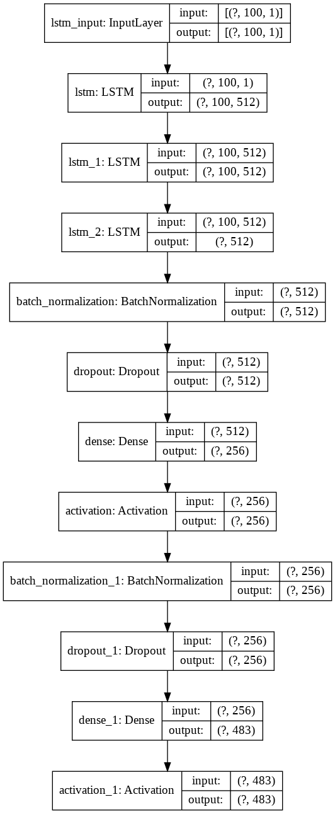

# Classical Piano Composer

## Overview

This project allows you to train a neural network to generate midi music files that make use of a single instrument.

## Model architecture
<div style="text-align:center">
    
</div>

## Usage

#### Training

1. In this directory create folder `midi_songs` and put every midi file.
2. Run method `dump_dataset()`. This convert all training files in to desired format and save it to disk.
3. Now you can train network or use pretrained model for generating song.

#### Directories

1. Directory `best` contains best weights
2. Directory `samples` contains generated music
3. Directory `weigths` contains all checkpoints in format `model-{epoch}-{loss}.h5`
4. Directory `dumps` contains converted training midi song in 1 file

#### Sample

```python3
# First of all, we need to prepare dataset and dump it on disk, only one time!
# notes = dump_dataset()

# Or, if dataset already created
notes = load_dataset('kaggle_ds_dump.notes')
pitch_names = sorted(set(item for item in notes))
latent_dim = len(set(notes))
x, x_normalized, y = prepare_sequences(notes, pitch_names, latent_dim)

# Build model
model = build_net(x_normalized, latent_dim)

# You can plot model architecture
# plot_model_architecture(model)

# If you want contain training from current weights
model.load_weights('./saved_model/best.h5')

# Train model
# train(model, x_normalized, y, epochs=4500, batch_size=128, save_period=250)

# And finally generate sample
raw_notes = generate_notes(model, x, pitch_names, latent_dim, generated_notes_number=500)
convert_to_midi(raw_notes)
```

## License

[MIT](LICENSE)
